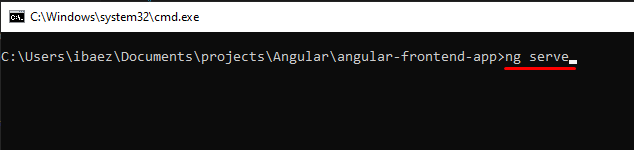
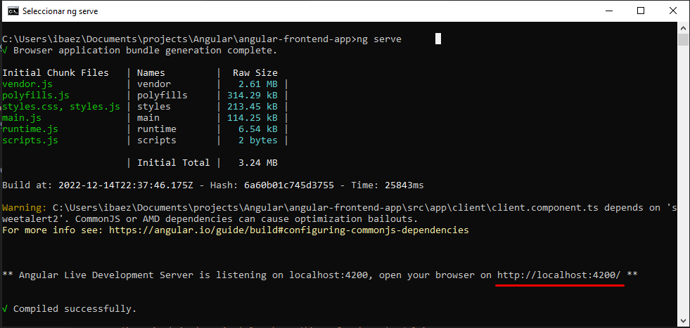

# Angular Frontend App

Este proyecto fue desarrollado con [Angular CLI](https://github.com/angular/angular-cli) versión 15.0.2.

Es un proyecto frontend, el cual consume datos de un Apirest desarrollado con Java y Springboot

## ¿Qué hace esta web?
***

Simplemente muestra la implementación de un CRUD, lo que, en palabras simples, sirve para obtener información desde una base de datos, poder crear nuevos registros, poder editarlos y también poder eliminarlos. Lo cual son las típicas funciones BASE de toda aplicación, ya sea Web, Escritorio o Mobile.

## Tecnologías principales usadas
***

* Angular 15.0.2
* Typescript
* Bootstrap 4.5.3
* Html 5
* CSS 3
* Sweetalert2

## ¿Como correr esta aplicación?
***

En primer lugar, tenemos la opción de verla en funcionamiento desde el siguiente link: [Angular Frontend App]() 

Otra opción es descargar este código o clonarlo con git para tenerlo de forma local en tu equipo.

## Requisitos para poder hacer despliegue de esta aplicación en tu computador
***

Tener instalado y desplegado el Apirest al cual esta aplicación se conecta, remítase al link: [Backend Api rest](https://github.com/ibaezar/spring-boot-backend-apirest) para obtener más información de esta parte del proyecto.

Tener instalado en nuestro equipo las herramientas NodeJS, NPM y Angular.

Enlace a las herramientas necesarias.

* [NodeJS](https://nodejs.org/en/)
* [NPM](https://www.npmjs.com/)
* [Angular](https://angular.io/cli)

## Despliegue de la aplicación
***

Una vez ya tengamos nuestro backend desplegado y corriendo.

Nos dirigimos a la raíz del proyecto Angular Frontend App desde CMD o cualquier otra consola según sea su Sistema Operativo.

Una vez ubicados en la raíz ejecutamos el comando: `ng serve`, como se muestra en la siguiente imagen:

Después de ejecutar dicho comando, en la consola aparecerá algo parecido a lo siguiente:

Aquí podemos ver que la aplicación levanto en la ruta http://localhost:4200/ por lo cual la copiamos y la pegamos en nuestro navegador de preferencia y ya tendríamos la aplicación lista para usar y probar.

## Contacto
***

* [Web](https://ibaezar.herokuapp.com/)
* [Linkedin](https://www.linkedin.com/in/ibaezar/)
* [Correo](mailto:ibaezar@outlook.com)
* [Whatsapp](https://wa.me/56936330855)